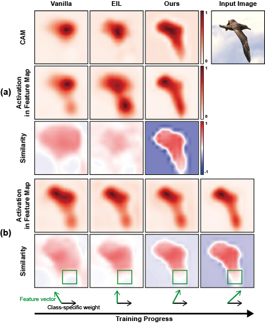

## Bridging the Gap for WSOL (CVPR 2022)

This is code for "Bridging the Gap between Classification and Localization for Weakly Supervised Object Localization."<br>
[ArXiv](https://arxiv.org/abs/2204.00220) | [CVF Open Access](https://openaccess.thecvf.com/content/CVPR2022/papers/Kim_Bridging_the_Gap_Between_Classification_and_Localization_for_Weakly_Supervised_CVPR_2022_paper.pdf)


This code is heavily borrowed from [Evaluating Weakly Supervised Object Localization Methods Right](https://github.com/clovaai/wsolevaluation).

This code is only allowed for non-commercial use.


## Abstract

Weakly supervised object localization aims to find a target object region in a given image with only weak supervision, such as image-level labels. Most existing methods use a class activation map (CAM) to generate a localization map; however, a CAM identifies only the most discriminative parts of a target object rather than the entire object region. In this work, we find the gap between classification and localization in terms of the misalignment of the directions between an input feature and a class-specific weight. We demonstrate that the misalignment suppresses the activation of CAM in areas that are less discriminative but belong to the target object. To bridge the gap, we propose a method to align feature directions with a class-specific weight. The proposed method achieves a state-of-the-art localization performance on the CUB-200-2011 and ImageNet-1K benchmarks.

<p align = "center">

</p>
<p align = "center">
Fig.1 - (a) Examples of CAM and decomposed terms from the classifier trained with the vanilla method and with EIL. (b) Visualization of the changes of CAM and decomposed terms as training with our method progresses.


## Environment

python == 3.8<br>
pytorch == 1.7.1 or 1.9.0<br>
matplotlib == 3.4.3<br>
opencv-python == 4.5.4.58<br>
munch == 2.5.0<br>
pyyaml == 5.4.1<br>
tqdm == 4.62.3


## Usage

### Step 1. Prepare Dataset

For the dataset, please refer to the [page](https://github.com/clovaai/wsolevaluation).
We use 'train-fullsup' that the [work](https://github.com/clovaai/wsolevaluation) provides as a validation set.
The dataset should be included in the folder 'dataset'.
If not, please change the 'data_root' in a config file.

We do not include metadata due to the capacity limit.
Please copy the files in the folder "metatdata" from the [page](https://github.com/clovaai/wsolevaluation) into the folder "metadata".

### Step 2. Train a model

An example command line for the train+eval:
```bash
python main.py --config ./configs/config_exp.yaml --gpu {gpu_num}
```

After training, it will automatically evaluate the trained model on the test set.


### Step 3. Evaluate a model

An example command line only for the test:
```bash
python main.py --config {log_folder}/config_exp.yaml --gpu {gpu_num} --only_eval
```

If you want to save cam, please add "--save_cam".
